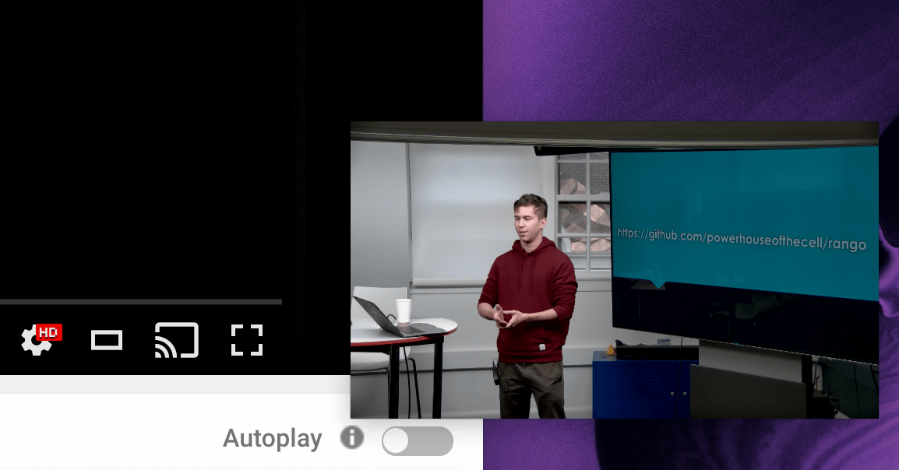
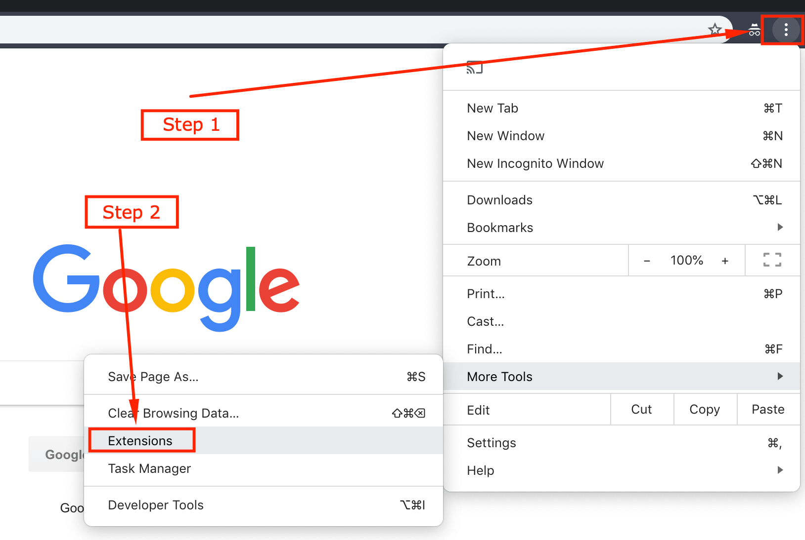
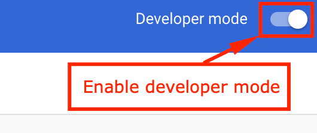
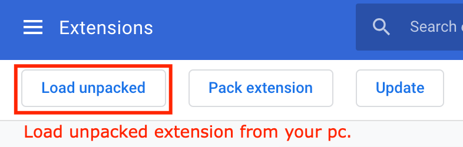
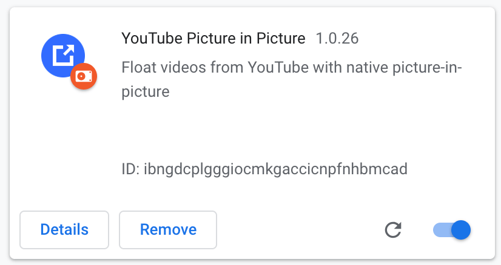

# YouTube Picture in Picture

Float videos from YouTube with native picture-in-picture.

[View](https://github.com/brunomacedo/video-picture-in-picture)

  

## Add it on Chrome Extensions as Developer Mode

How to add it on Chrome as Developer Mode

1. Clone this [repository](https://github.com/brunomacedo/video-picture-in-picture) to any place on your pc.

2. Right Menu > More Tools > **Extensions**

  

3. Enable Developer Mode

  

4. Load unpackaged > Find the cloned folder on your pc

  

5. Done =)

  

