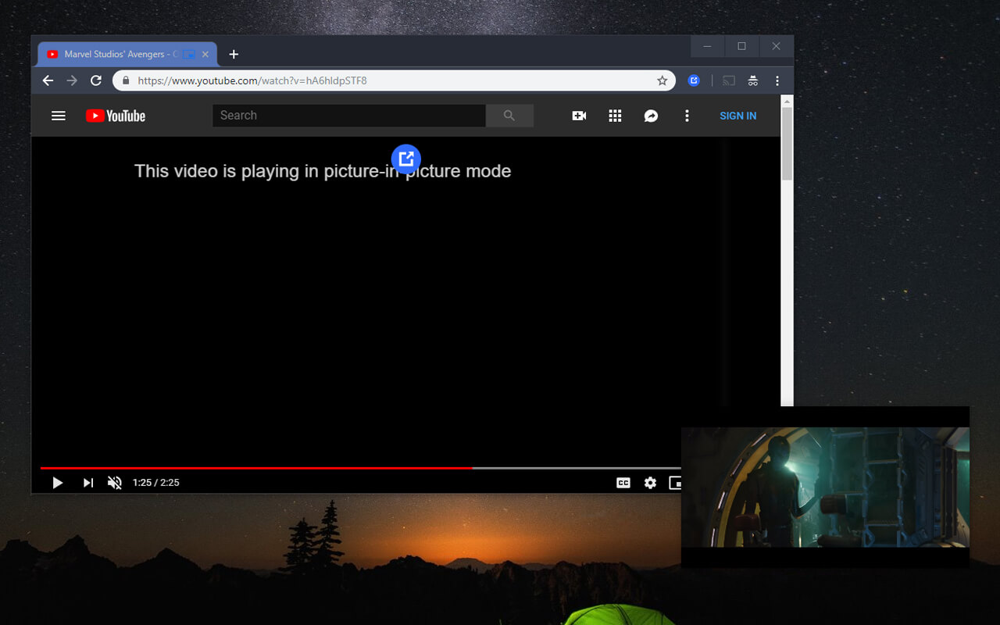

# YouTube Picture in Picture

Float videos from YouTube with native picture-in-picture.

[Install](https://chrome.google.com/webstore/detail/youtube-picture-in-pictur/flfgfoknpbdaddimcppfkkhmgckcgoan)

  

